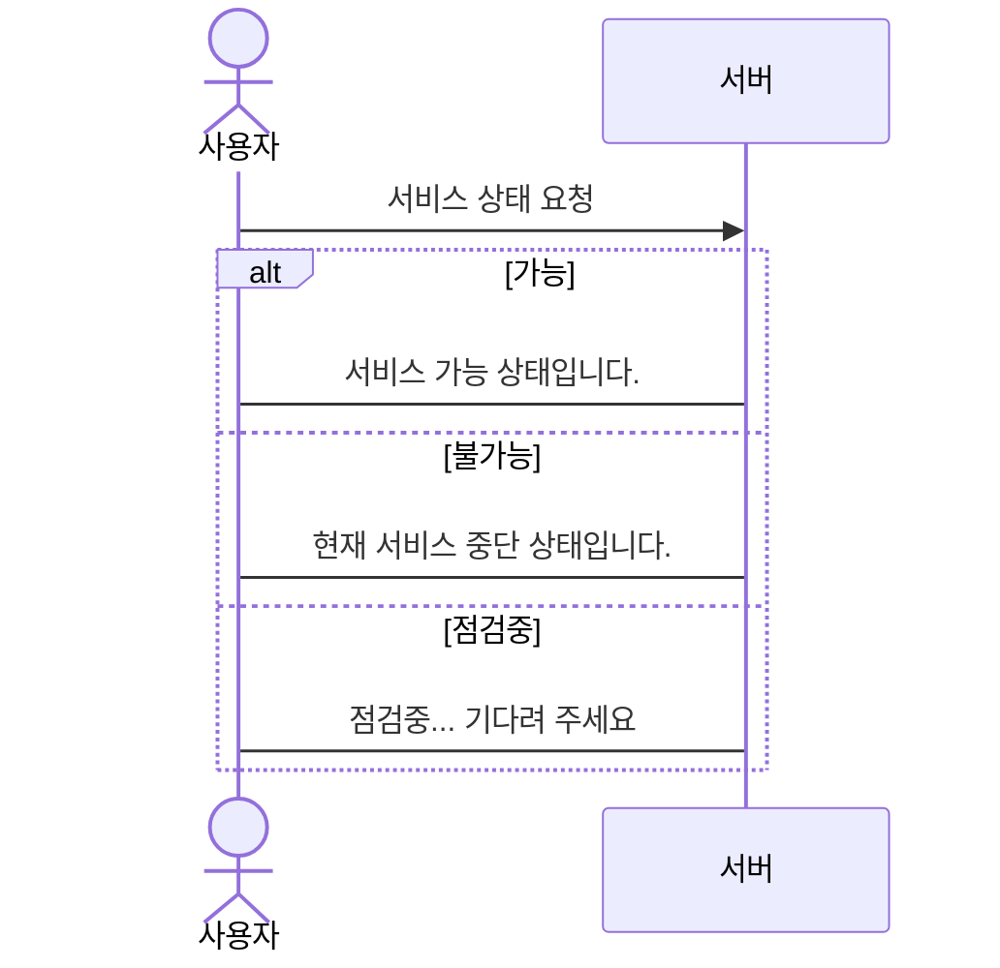

# 대안 경로 (alternatives)

객체에서 다른 객체로 메시지를 보낸 경우, 답변이 경우에 따라 다른 경우를 표현할 때 사용합니다.

답변이 여러가지인 경우 아래와 같이 사용합니다.

```
alt 대안 설명

    ... 작업 내용 ...

else

    ... 작업 내용 ...

end
```

사용자가 현재 서비스 가능 상태를 묻는 예제로 실습해 보겠습니다.

````

````

- `alt` ~ `else` ~ `end` 구조에서 답변 조건이 여러개일 경우 `else`를 중복해서 제한없이 사용할 수 있습니다.

```{mermaid}
sequenceDiagram
    actor A as 사용자
    participant B as 서버
    
    A ->> B: 서비스 상태 요청
    
    alt 가능
        B -> A: 서비스 가능 상태입니다.
    else 불가능
        B -> A: 현재 서비스 중단 상태입니다.
    else 점검중
        B -> A: 점검중... 기다려 주세요
    end
```

메시지를 요청 보낸 경우 답변을 받아도 되고 안 받아도 되는 경우도 있습니다. 

옵션인 경우겠죠?

`alt` ~ `else` ~ `end` 구조로 본다면 굳이 `else`가 필요없는 경우입니다.

이렇게 단일 옵션을 표현할 때는 `opt` 구문을 사용합니다.

```
opt 옵션 설명

    ... 작업 내용 ...

end
```

앞 예제에서 서버가 옵션으로 자신의 서비스명(service name)을 옵션으로 보내는 상황을 `opt`을 사용하여 실습해 보겠습니다.

````

````

```{mermaid}
sequenceDiagram
    actor A as 사용자
    participant B as 서버
    
    A ->> B: 서비스 상태 요청
    
    alt 가능
        B -> A: 서비스 가능 상태입니다.
    else 불가능
        B -> A: 현재 서비스 중단 상태입니다.
    else 점검중
        B -> A: 점검중... 기다려 주세요
    end

    opt 추가답변
        B -> A: 서비스 이름은 온라인 대박몰 입니다.
    end
```