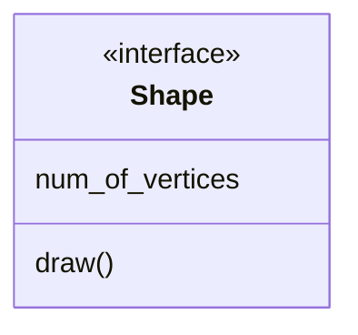

# Annotations & Comments

클래스 다이어그램을 그리다 보면 이런 저런 클래스를 다양하게 생성하게 됩니다. 

클래스 갯수가 많아지면 개별 클래스의 역할이 헷갈릴 수 있습니다. 

이런 경우 클래스에 메타 데이터 처럼 주석을 달아주면 좋을 것입니다.

Mermaid는 클래스에 대한 명확한 이해를 위해 클래스에 마커(marker, 표시 딱지)와 같은 설명문을 추가할 수 있습니다. 이렇게 추가되는 설명문을 `class annotation` 이라고 부릅니다.

Annotation을 정의하기 위해서는 `<<`로 시작하고 `>>`로 닫습니다. `<<`와 `>>` 사이에 원하는 annotation 종류를 적어주면 됩니다. 

주로 사용하는 annotation 종류는 다음과 같습니다.

|표현|설명|
|:--|:--|
|`<<interface>>`|인터페이스 역할을 하는 클래스|
|`<<abstract>>`|추상 클래스|
|`<<service>>`|서비스 클래스|
|`<<enumeration>>`|`enum` 역할을 하는 클래스|
|||

이제 실습해 보겠습니다.

인터페이스 클래스를 만들어 봅니다.

````

````

중괄호 `{}`를 이용한 표현을 사용해도 annotation은 잘 작동합니다. 다음 코드는 정확히 동일한 결과를 생성합니다.

````

````

```{mermaid}
classDiagram 
    class Shape {
        <<interface>> 
        num_of_vertices
        draw()
    }
```

이번에는 추상 클래스를 그려 봅니다.

````
```{mermaid}
classDiagram 
    class Shape {
        <<abstract>> 
        num_of_vertices
        draw()*
    }
```
````

```{mermaid}
classDiagram 
    class Shape {
        <<abstract>> 
        num_of_vertices
        draw()*
    }
```

`enum` 클래스를 그려 보겠습니다.

````
```{mermaid}
classDiagram
    class Color{
        <<enumberation>>
        RED
        GREEN
        BLUE
        WHITE
        BLACK
    }
```
````

```{mermaid}
classDiagram
    class Color{
        <<enumberation>>
        RED
        GREEN
        BLUE
        WHITE
        BLACK
    }
```
