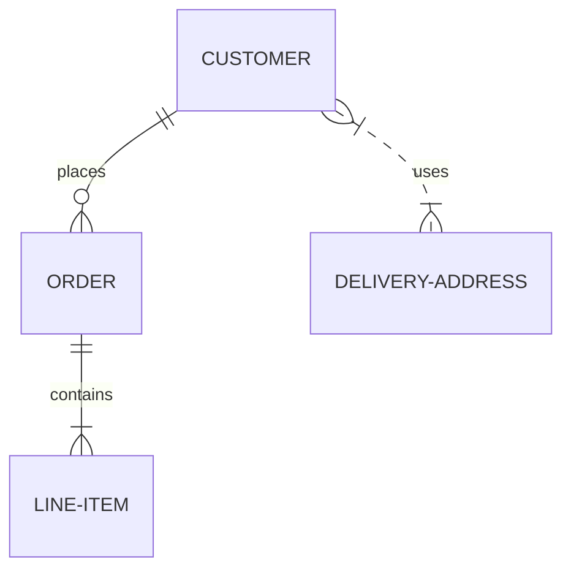

# 개체와 관계

Mermaid로 ERD를 그리는 것은 `erDiagram` 이라는 키워드를 사용하면 됩니다.

구체적인 내용을 살펴보기 전에 대략적인 구성을 살펴보도록 하겠습니다.

````

````

```{mermaid}
erDiagram
    CUSTOMER ||--o{ ORDER : places
    ORDER ||--|{ LINE-ITEM : contains
    CUSTOMER }|..|{ DELIVERY-ADDRESS : uses
```

위 ERD에는 4개의 개체(`CUSTOMER`, `ORDER`, `DELIVERY-ADDRESS`, `LINE-ITEM`)를 생성하였습니다. 개체(entity)는 일반적으로 대문자로 표기하지만 아직 정해진 규칙은 없습니다.

개체와 개체의 관계(relationship)는 선으로 표현되었습니다. 편의상 `관계선`이라고 부르겠습니다.
관계선의 끝 부분에는 제약조건(cardinality)dmf 표현하는 기호(그림 모양)가 붙었습니다. 자세한 내용은 [](erd-intro)에서 설명한  {numref}`crow-foot-cardinality-table`을 참고하기 바랍니다.