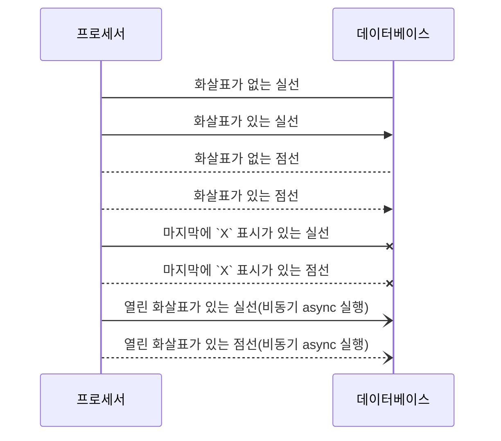

# 메세지(Messages)

참여자 또는 행위자들 사이에서 발생하는 메시지를 표현하는 방법을 정의합니다.

기본 문법은 다음과 같습니다.


`참여자[또는 행위자]`  `연결선`  `참여자[또는 행위자]`: `메시지 내용`

`연결선` 종류는 다음과 같습니다.

|표현|설명|
|:--|:--|
|`->`|화살표가 없는 실선|
|`-->`|화살표가 없는 점선|
|`->>`|화살표가 있는 실선|
|`-->>`|화살표가 있는 점선|
|`-x`|마지막에 `X` 표시가 있는 실선|
|`--x`|마지막에 `X` 표시가 있는 점선|
|`-)`|열린 화살표가 있는 실선(비동기 async 실행)|
|`--)`|열린 화살표가 있는 점선(비동기 async 실행)|
|||

비동기(`async`hronous) 실행은 요청을 보낸 후 답변이 올때까지 기다리지 않고 다른 작업을 수행한다는 의미입니다. 일반적으로 `async` 처리는 화살표 끝모양이 개방된 형태로 -> 표현합니다.

한편, 동기(`sync`hronous) 실행은 요청을 보내 후 답변이 올때까지 기다리는 동작을 의미합니다. `sync` 작업은 화살표 끝이 검정색으로 채워진 삼각형 모양을 -$\blacktriangleright$ 이용해 표현합니다.


위 표에서 설명한 연결선을 이용한 메시지 표현을 실습해 보겠습니다.

````

````

```{mermaid}
sequenceDiagram
    participant A as 프로세서
    participant B as 데이터베이스
    
    # 연결선 모양
    A -> B: 화살표가 없는 실선
    A ->> B: 화살표가 있는 실선
    A --> B: 화살표가 없는 점선
    A -->> B: 화살표가 있는 점선
    A -x B: 마지막에 `X` 표시가 있는 실선
    A --x B: 마지막에 `X` 표시가 있는 점선
    A -) B: 열린 화살표가 있는 실선(비동기 async 실행)
    A --) B: 열린 화살표가 있는 점선(비동기 async 실행)
```


