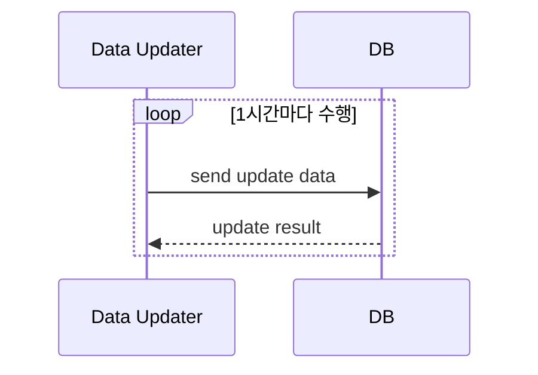

# 반복(loop) 표현

시퀀스 다이어그램에서 작업이 반복적으로 수행되는 영역 `loop` 라고 부릅니다.

Mermaid에서 loop를 표현하는 방법은 다음과 같습니다.

```
loop 반복내용
... 작업내용 ...
end
```

어떤 시스템이 데이터베이스에 1시간에 1번씩 자료 업데이트 요청을 보내는 예제를 실습해 보겠습니다.

````

````

```{mermaid}
sequenceDiagram
    participant A as Data Updater
    participant B as DB
    loop 1시간마다 수행
        A ->> B: send update data
        B -->> A: update result
    end

```