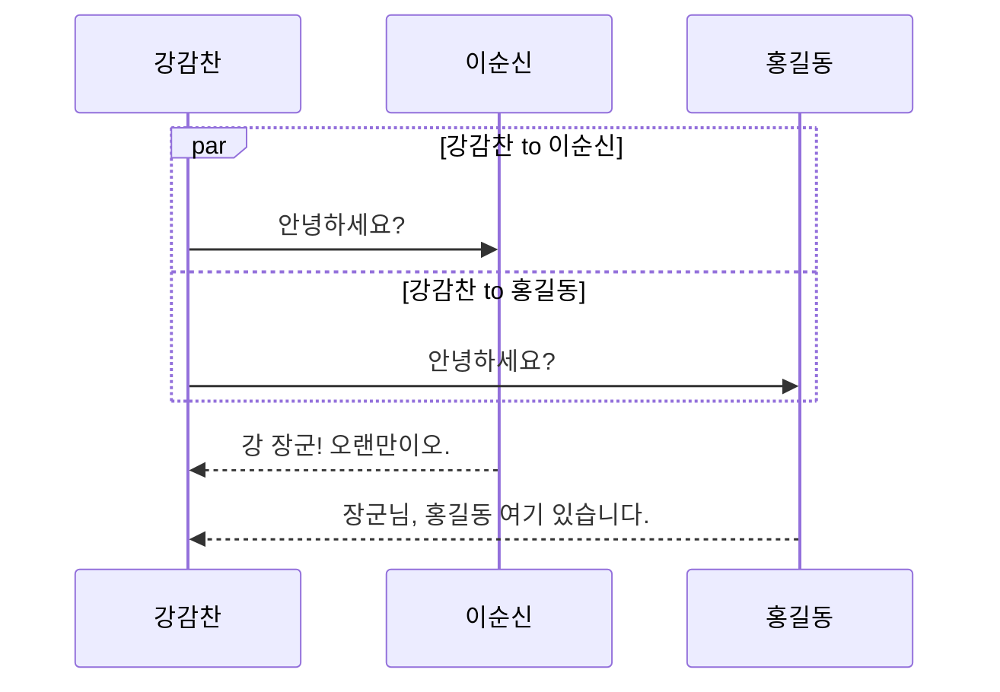

# 병렬 경로 (parallel)

하나의 객체에서 여러 객체에 동시에 메시지를 전달하는 상황을 표현할 때 사용합니다.

병렬을 뜻하는 parallel을 줄여서 `par` 라는 키워드를 사용합니다.

사용 방법은 다음과 같습니다.

```
par 전달경로1
    
    ... 작업 내용 ...

and 전달경로2
    
    ... 작업내용 ...

   :
   :

and 전달경로 N
    
    ... 작업내용 ...

end
```

## 메시지 병렬 전달 

하나의 객체에서 다른 2개 객체로 메시지를 전달하고 답변을 받는 예제를 실습해 보겠습니다.

````

````

```{mermaid}
sequenceDiagram
    par 강감찬 to 이순신
        강감찬 ->> 이순신: 안녕하세요?

    and 강감찬 to 홍길동
        강감찬 ->> 홍길동: 안녕하세요?
    end
    
    이순신 -->> 강감찬: 강 장군! 오랜만이오.
    홍길동 -->> 강감찬: 장군님, 홍길동 여기 있습니다.
```

## 중첩된 병렬 전달

메시지를 전달 받은 후 병렬 전달 내부에 병렬 전달을 포함할 수 있습니다.

```{mermaid}
sequenceDiagram
    participant A as 강감찬
    participant B as 이순신
    participant C as 홍길동
    participant D as 개똥이
    participant E as 마당쇠

    par A to C
        A ->> B: 부대 주변을 정찰해 주세요.
    and B to C
        A ->> C: 부대 주변을 정찰해 주세요.
    
        par C to D
            C ->> D: 산속을 정찰하세요
        and B to C
            C ->> E: 들판을 정찰하세요
        D ->> C: 산속은 조용합니다.
        E ->> C: 들판에 사람들이 모여 있습니다.
        end
    
    B ->> A: 알겠소이다 장군.
    C ->> A: 들판에 수상한 조짐이 있습니다.
    end

```