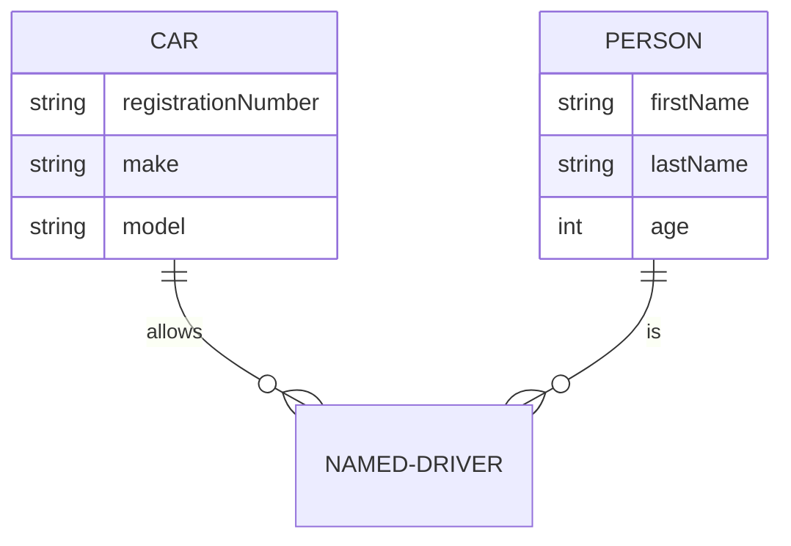

# 속성(Attributes)

개체가 가지고 있는 속성을 정의하는 방법에 대해 살펴보겠습니다.

개체 속성은 개체 이름(name) 다음에 중괄호 `{}`를 쓰고 내부에 `자료형(type) 이름(name)` 형태로 차례대로 써주면 됩니다.

## 속성 설정하기

`CAR` 개체와 `PERSON` 개체의 관계를 설정하고, 각 개체의 속성(attributes)를 정의하는 예를 살펴보겠습니다.

````

````

```{mermaid}
erDiagram
    CAR ||--o{ NAMED-DRIVER : allows
    CAR {
        string registrationNumber
        string make
        string model
    }
    PERSON ||--o{ NAMED-DRIVER : is
    PERSON {
        string firstName
        string lastName
        int age
    }
```

위 예제에서 `CAR` 개체에는 문자열(`string`) 형태의 `registrationNumber`, `make`, `model` 이라는 속성을 정의했습니다.

유사하게 `PERSON` 개체에는 문자열(`string`) 형태의 `firstName`과 `lastName` 속성을 정의하고, 정수형(`int`) `age` 속성을 정의하였습니다.

개체 속성은 개체를 표시하는 사각형 안에 표시됩니다.

`자료형(type)`과 `이름(name)`은 반드시 알파벳 글자로 시작해야 하며, 알파벳 이후에 숫자, 하이픈(`-`), 언더스코어(`_`)를 혼합해서 사용할 수 있습니다.

## 속성의 키(Keys)와 주석(Comments)

때때로 속성에 키(`key`) 또는 주석(`comment`)을 부여해야 할 경우가 있습니다.

키(`key`)는 `Primary Key (PK)` 또는 `Foreign Key (FK)`가 될 수 있습니다. 

주석(`comment`)은 키(`key`)에 대한 설명을 붙여주고 싶을 때 사용합니다.

키와 주석을 정의하는 방법은 다음과 같습니다.

`자료형(type) 이름(name) PK[FK] "주석(속성에 대한 설명"`

앞에서 사용했던 `CAR`와 `PERSON` 개체에 키와 주석을 추가로 정의하는 예제는 다음과 같습니다.
- `CAR` 개체: `allowedDrive` 속성에 `FK` 지정하고, 주석으로 `The license of the allowed driver` 추가
- `PERSON` 개체: `driverLicense` 속성에 `PK` 지정하고, 주석으로 `The driver license number` 추가

````
```{mermaid}
erDiagram
    CAR ||--o{ NAMED-DRIVER : allows
    CAR {
        string allowedDriver FK "The license of the allowed driver"
        string registrationNumber
        string make
        string model
    }
    PERSON ||--o{ NAMED-DRIVER : is
    PERSON {
        string driversLicense PK "The driver license number"
        string firstName
        string lastName
        int age
    }
```
````

```{mermaid}
erDiagram
    CAR ||--o{ NAMED-DRIVER : allows
    CAR {
        string allowedDriver FK "The license of the allowed driver"
        string registrationNumber
        string make
        string model
    }
    PERSON ||--o{ NAMED-DRIVER : is
    PERSON {
        string driversLicense PK "The drive license number"
        string firstName
        string lastName
        int age
    }
```