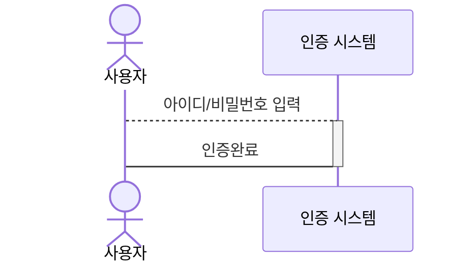
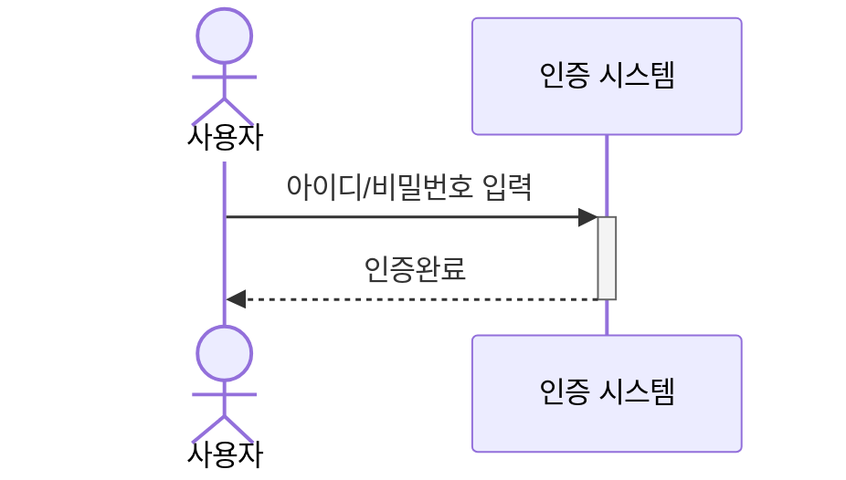
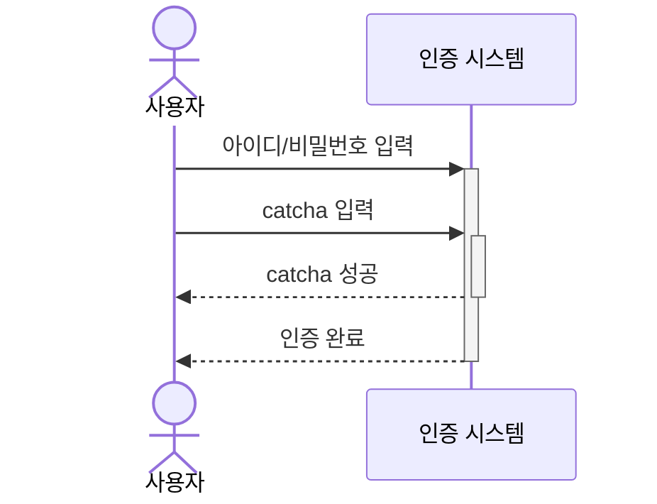
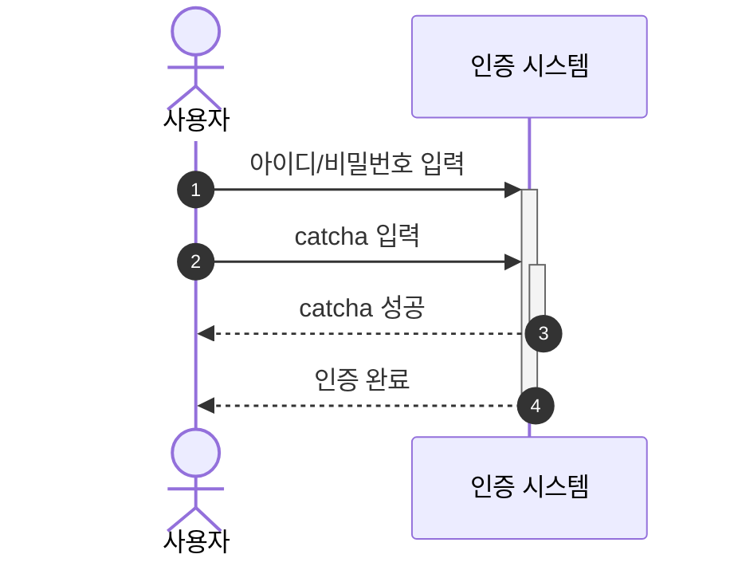

# Activation 표시

## 기본 표현
    
Activation은 객체의 작동이 시작됨을 표시합니다.

반대로 deactivation은 객체의 작동이 끝난 것을 표현해 줍니다.

사용자가 아이디와 비밀번호를 입력하면 웹 시스템은 인증 절차를 시작하게 되는데 이 경우는 인증 기능이 activation 되었다고 할 수 있습니다.

웹 시스템이 사용자 인증 절차를 마치고 사용자를 시스템에 진입 시키면 이 때는 인증 기능이 deactivation 된 상태입니다.

사용자와 인증 시스템을 예시로 실습해 보겠습니다.

````

````

```{mermaid}
sequenceDiagram
    actor A as 사용자
    participant B as 인증 시스템
    A ->> B: 아이디/비밀번호 입력
    activate B
    B -->> A: 인증완료
    deactivate B
```

## 단축 표현 

위 예제에서 Activation/deactivation을 표현하기 위해 각각 `activate`와 `deactivate`라는 키워드를 사용했습니다.

코딩하는 사람 입장에서 생각해 라인수가 길어져서 번거로울 수 있습니다. 문서 작성자가 편리하도록 `activation` 대신에 연결선 끝부분에 `+` 기호를 붙이면 `activation` 키워드를 대체할 수 있습니다. `deactivation`은 `-` 기호를 붙여 줍니다.

위 예제는 아래와 같이 작성하여도 동일한 결과를 보여줍니다.

````

````

```{mermaid}
sequenceDiagram
actor A as 사용자
participant B as 인증 시스템
A ->>+ B: 아이디/비밀번호 입력
B -->>- A: 인증완료
```

## 중첩 표현
  
Activation은 중첩 표현 가능합니다. 

하나의 activation이 시작된 이후에 다른 activation을 추가하면 중첩된 activation으로 표현됩니다.

````

````

```{mermaid}
sequenceDiagram
    actor A as 사용자
    participant B as 인증 시스템
    A ->>+ B: 아이디/비밀번호 입력
    A ->>+ B: catcha 입력
    B -->>- A: catcha 성공
    B -->>- A: 인증 완료
```

## 메시지 넘버링

시퀀스 다이어그램에서 발생하는 다양한 메시지 전달 과정에 번호를 달아줄 수 있다면 가독성이 향상되고 시스템 작동을 좀 더 쉽게 이해할 수 있을 것입니다.

Mermaid는 간단하게 메시지 작동 순서에 번호를 부여할 수 있습니다.

설정 방법은 단순히 `autonumber` 옵션을 부여하면 됩니다.

위에서 사용한 예제에 번호를 부여해 보겠습니다.

````

````

```{mermaid}
sequenceDiagram
    autonumber
    actor A as 사용자
    participant B as 인증 시스템
    A ->>+ B: 아이디/비밀번호 입력
    A ->>+ B: catcha 입력
    B -->>- A: catcha 성공
    B -->>- A: 인증 완료
```