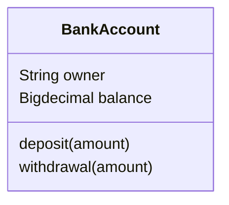
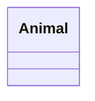
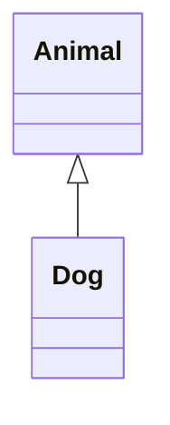
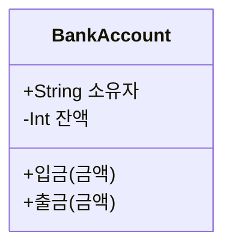
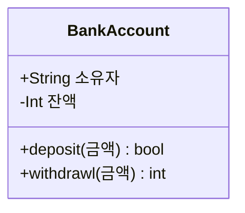
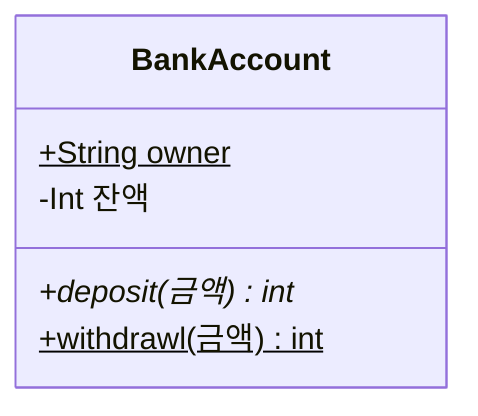
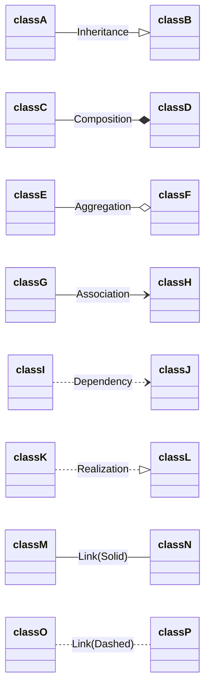

# 구성요소 정의

클래스 다이어그램은 클래스와 클래스 사이의 관계로 표현할 수 있습니다.

우리는 다음과 같은 순서로 실습을 진행하겠습니다.
1. 클래스 표현 규칙
2. 클래스 멤버 정의
3. 클래스 가시성 정의
4. 클래스 관계 정의

## 클래스 표현 규칙

사람마다 클래스를 표현하는 방법이 다르다면 클래스 다이어그램을 보는 사람들은 매우 혼란스러울 것입니다. 그래서 소프트웨어 설계자/개발자들이 모여서 다양한 다이어그램을 그리는 규칙을 정의해 놓았습니다.

통일된 그리기 규칙을 `UML (Unified Modeling Language)` 라고 부릅니다. 

```{admonition} UML에 대한 구체적인 내용
UML을 보다 구체적으로 알고 싶은 사람은 소프트웨어공학(Software Engineering) 관련 서적을 공부하시거나, UML 관련 인터넷 [튜토리얼](https://sparxsystems.com/resources/tutorials/uml/part1.html)을 참고하기 바랍니다.
```

클래스 다이어그램도 자주 사용하기 때문에 당연히 UML에 그리는 방법이 정해져 있습니다. 

먼저 클래스를 그리는 규칙은 3가지 입니다.

- 클래스 이름(name): 가장 상단에 클래스의 이름을 씁니다. 가운데 정렬하고 굵게 씁니다. 각 단어의 첫 단어는 대문자를 사용하고, 설명문(annotation)을 추가할 수 있습니다.
- 클래스 속성(attributes): 가운데에 클래스가 사용하는 속성을 씁니다. 왼쪽 정렬하고 속성 이름은 소문자로 씁니다.
- 클래스 동작(operations): 바닥 부분에는 클래스의 실행을 표현하는 동작(operation)들을 씁니다. 속성과 마찬가지로 왼쪽 정렬하고 소문자로 씁니다.

클래스 그리기 규칙을 적용한 실습은 다음과 같습니다. 

우선은 클래스가 세로 3개로 구분된 직사각형으로 표현하고 각 직사각형에 클래스 이름, 속성, 동작에 대한 내용을 적어 준다는 것만 살펴보도록 합니다. 

실습을 진행하면서 좀 더 구체적으로 살펴보겠습니다.

````

````

```{mermaid}
classDiagram
    class BankAccount
    BankAccount : String owner
    BankAccount : Bigdecimal balance
    BankAccount : deposit(amount)
    BankAccount : withdrawal(amount)
```

## 클래스 정의

Mermaid에서 클래스를 정의하기 위해서는 `classDiagram` 이라는 키워드를 써주는 것으로 시작합니다.

개별 클래스를 정의하는 방법은 2가지 입니다.

첫째, `class` 라는 키워드를 사용해 명시적으로 정의하는 방법입니다.

다음 예제는 `class` 키워드를 사용해서 Animal 이라는 클래스를 정의한 경우입니다.

````

````

```{mermaid}
classDiagram
    class Animal
```

둘째, 클래스 사이의 상속 관계를 표현하는 `--|>` 키워드를 이용하는 방법입니다. 

다음 예제는 Dog 클래스가 Animal 클래스를 상속 받은 경우입니다. `class` 라는 키워드를 사용하지 않아도 필요한 클래스를 자동으로 새성해 줍니다.

````

````

```{mermaid}
classDiagram 
    Animal <|--  Dog
```

## 클래스 멤버 정의

UML은 클래스 속성과 메서드를 정의하고 추가 설명을 추가할 수 있는 규칙을 정의하고 있습니다.

물론 Mermaid도 UML에서 정한 규칙을 지원합니다.

클래스의 멤버는 속성(attributs)와 메서드(methods)로 구분할 수 있습니다.

Mermaid는 클래스의 속성과 메서드를 구분하기 위하여 소괄호 `()`를 사용합니다. `()`와 같이 사용되는 것은 메서드 또는 함수로 인식합니다. `()`가 없다면 속성으로 인식합니다.

클래스 멤버를 정의하는 방법은 2가지 입니다. 

### `이름: 멤버` 형태로 정의

클래스 멤버를 정의하는 첫번째 방법은 `클래스 이름 : 멤버` 형태로 정의하는 것입니다. 

클래스 멤버가 몇 개 안되는 간단한 클래스를 정의할 때 유용합니다. 

예를 들어 보겠습니다.

````
```mermaid
classDiagram BankAccount
    class 
        BankAccount: +String 소유자
        BankAccount: -Int 잔액
        BankAccount: +입금(금액)
        BankAccount: +출금(금액)
```
````

- 이 예제에서 `String`, `Int`는 자료형(data type) 입니다. `+` 기호는 `public`을, `-` 기호는 `private`을 의미합니다. `소유자`, `잔액`은 `()`가 없기 때문에 속성(attributs) 입니다.
- 이 예제에서 `+입금()`, `+출금금()`은 `()`와 같이 사용되었기 때문에 클래스의 메서드 입니다. 


```{mermaid}
classDiagram
    class BankAccount
        BankAccount: +String 소유자
        BankAccount: -Int 잔액
        BankAccount: +입금(금액)
        BankAccount: +출금(금액)
```

### 중괄호 `{}`를 이용한 정의

클래스를 정의하는 다른 방법은  `클래스 이름 : 멤버`을 사용하는 대신, 중괄호 `{}`를 사용하는 방법입니다. 클래스의 멤버가 많을 경우 일일히 `클래스 이름: ` 타이핑 해야하는 번거로움을 줄일 수 있습니다. 앞 예제를 `{}`를 이용해 구현해 보겠습니다.

````

````

```{mermaid}
classDiagram
    class BankAccount{
        +String 소유자
        -Int 잔액
        +입금(금액)
        +출금(금액)
    }
```

클래스 메서드가 반환값이 있을 경우 반환형(return type)을 정의할 수 있습니다. `메서드이름(메서드 입력) 반환형`와 같이 사용하면 됩니다. 메서드이름 이후에 `)` 다음 한칸 띄우고 반환형을 적어 주면 됩니다.

````

````
- 반환형이 있는 경우 한글 메서드 이름을 지원하지 않아 메서드 이름을 `deposit`, `withdrawl`로 변경하였습니다.
```{mermaid}
classDiagram
    class BankAccount{
        +String 소유자
        -Int 잔액
        +deposit(금액) bool
        +withdrawl(금액) int
    }
```

## 클래스 멤버 가시성

객체지향 설계에는 `정보은닉(information hiding)`이라는 개념이 있습니다. 사용자에게 필요한 멤버는 접근을 허용하고, 불필요한 정보는 감추는 개념입니다. 앞 예제에는 `+`와 `-` 기호를 정보은닉을 표현하였습니다.

소프트웨어 설계자/개발자가 지정한 정보 은닉 수준에 따라 다른 클래스나 함수에서 볼 수 있는 멤버가 있고, 보이지 않는 멤버들도 있습니다. 이러한 특징을 `가시성(visibility)` 이라고 부릅니다.

Mermaid에서 지원하는 `visibuilty` 표현 연산자는 다음과 같습니다.

|문법|정의|설명|
|:---|:---|:---|
|`+`|public|클래스 외부에서 모두 접근 가능|
|`-`|private|클래스 외부에서 모두 접근 불가, 클래스 멤버만 접근 가능|
|`#`|protected|클래스를 상속받은 클래스의 멤버들만 접근 가능|
|`~`|package(internal)|패키지로 묶인 클래스의 멤버들만 접근 가능|
||||

```{admonition} package
`package`는 비슷한 기능을 모아 두는 것을 의미합니다. 주로 하나의 폴더에 비슷한 기능을 담당하는 것들을 모아 둡니다. Java 언어의 경우 `package`라는 명령어를 사용합니다. `Python` 언어의 경우 폴더 구조 자체를 자동으로 `package`로 인식합니다 (`Python 3.3` 이전의 구버전(old version)에서는 폴더마다 `__init__.py` 파일을 생성해 주어야 합니다.)
```

구현(코딩) 하다보면 종종 `추상(abstract) 메서드`를 선언하거나 `정적(static) 속성/메서드`를 정의해야 할 경우가 있습니다.  경우  추상 클래스는 `*` 연산자를, 정적 속성/메서드는 `$` 연산자를 이용하여 표현합니다.

|문법|정의|사용법|
|:---|:---|:---|
|`*`|abstract class|`추상_클래스_이름*`|
|`$`|static attribute/method|`정적_메서드/정적_속성$`|
||||


다음 예시는 속성 `ower`와 메서드 `withdraw`를 static으로 지정하고, 속성 `deposit`을 추상 메서드로 지정한 것입니다.

Static으로 지정된 멤버는 밑줄이 그어지고, 추상 메서드로 지정된 멤버는 이탤릭(기울어진) 모양으로 표시됩니다.

````

````

```{mermaid}
classDiagram
    class BankAccount{
        +String owner$
        -Int 잔액
        +deposit(금액)* int
        +withdrawl(금액)$ int
    }
```

## 클래스 관계 정의

클래스와 클래스 사이의 관계를 표현하는 문법은 다음과 같습니다.

```
`클래스이름  연결선  클래스이름`
```


클래스 사이의 관계를 정의하는 `연결선` 종류는 다음과 같습니다.

|종류|설명|
|:--|:--|
|`<\|--`|상속(inheritance)|
|`*--`|합성(composition)|
|`o--`|집합(aggregation)|
|`-->`|연관(association)|
|`..>`|의존(dependency)|
|`..\|>`|실체화(realization)|
|`--`|연결(link), 실선 표시|
|`..`|연결(link), 점선 표시|
|||

위 관계를 종류별로 간단히 구현하면 다음과 같습니다.

````
```{mermaid}
classDiagram
    classA <|-- classB
    classC *-- classD
    classE o-- classF
    classG <-- classH
    classI <.. classJ
    classK <|.. classL
    classM -- classN
    classO .. classP
```
````

```{mermaid}
classDiagram
    direction LR
    classA <|-- classB
    classC *-- classD
    classE o-- classF
    classG <-- classH
    classI <.. classJ
    classK <|.. classL
    classM -- classN
    classO .. classP
```

연결선의 의미를 명확하 하기 위하여 연결선에 설명을 추가할 수 있습니다.

설명선 추가 실습 코드는 다음과 같습니다.

````

````

```{mermaid}
classDiagram
    direction LR
    classA --|> classB : Inheritance
    classC --* classD : Composition
    classE --o classF : Aggregation
    classG --> classH : Association
    classI ..> classJ : Dependency
    classK ..|> classL : Realization
    classM -- classN : Link(Solid)
    classO .. classP : Link(Dashed)
```

필요에 따라 연결선의 양 끝을 사용자가 자유롭게 설정할 수 있습니다.

연결선의 양 끝 모양은 다음과 같이 지정합니다.

`연결선 끝모양` + `선 종류` + `연결선 끝모양`

|연결선 끝모양|설명|
|:--|:--|
|`<\|`|상속(inheritance)|
|`*`|합성(composition)|
|`o`|집합(aggregation)|
|`>`|연관(association)|
|`<`|연관(association)|
|`\|>`|실체화(realization)|
|||

|연결선 종류|설명|
|:--|:--|
|`--`|실선 표시|
|`..`|점선 표시|
|||


예를 들면 다음과 같이 연결선을 지정할 수 있습니다.

````
```{mermaid}
classDiagram
    Animal <|--|> Zebra
```
````

```{mermaid}
classDiagram
    Animal <|--|> Zebra
```