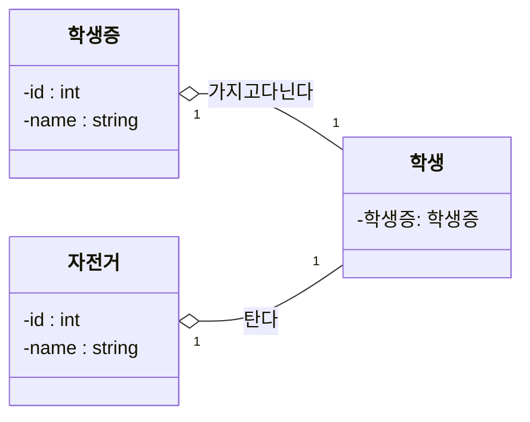

# 클래스 방향 설정

여러 클래스가 관계를 맺고 있는 경우 방향을 설정할 수 있습니다. 

설정할 수 있는 방향의 종류는 [](flowchart-graph)를 참고하기 바랍니다. 

클래스는 방향 설정에 따라 자동으로 배치 됩니다.

먼저 `LR (Left` $\to$ `Right)` 옵션으로 클래스 배치를 설정해 보겠습니다.

````

````

```{mermaid}
classDiagram
  direction RL
  class 학생 {
    -학생증: 학생증
  }
  class 학생증 {
    -id : int
    -name : string
  }
  class 자전거 {
    -id : int
    -name : string
  }
  학생 "1" --o "1" 학생증 : 가지고다닌다
  학생 "1" --o "1" 자전거 : 탄다
```

동일한 클래스 다이어그램을 `TB (Top` $\to$ `Bottom)` 옵션으로 설정하면 다음과 같은 그림이 생성됩니다.

````
```{mermaid}
classDiagram
  direction TB
  class 학생 {
    -학생증: 학생증
  }
  class 학생증 {
    -id : int
    -name : string
  }
  class 자전거 {
    -id : int
    -name : string
  }
  학생 "1" --o "1" 학생증 : 가지고다닌다
  학생 "1" --o "1" 자전거 : 탄다
```
````

```{mermaid}
classDiagram
  direction TB
  class 학생 {
    -학생증: 학생증
  }
  class 학생증 {
    -id : int
    -name : string
  }
  class 자전거 {
    -id : int
    -name : string
  }
  학생 "1" --o "1" 학생증 : 가지고다닌다
  학생 "1" --o "1" 자전거 : 탄다
```