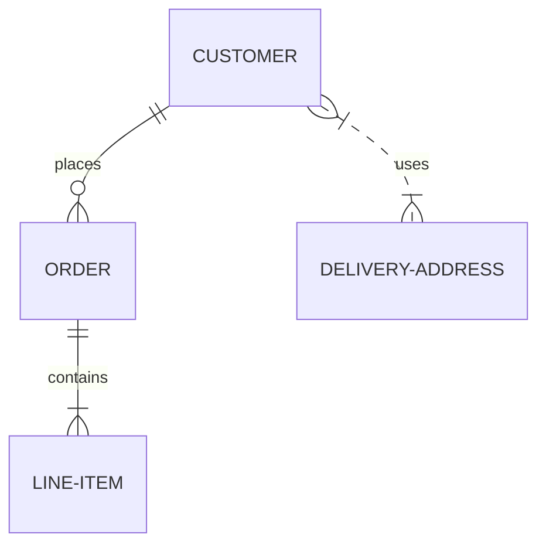

# 크로우 풋 ERD 살펴보기

Mermaid로 ERD를 그리는 것은 `erDiagram` 이라는 키워드를 사용하면 됩니다.

구체적인 내용을 살펴보기 전에 대략적인 구성을 통해 ERD 감잡기를 하겠습니다. 이후에 구체적인 설명을 통해 보다 깊이 크로우 풋 ERD를 이해할 수 있도록 실습을 진행하겠습니다.

````

````

```{mermaid}
erDiagram
    CUSTOMER ||--o{ ORDER : places
    ORDER ||--|{ LINE-ITEM : contains
    CUSTOMER }|..|{ DELIVERY-ADDRESS : uses
```

위 ERD에는 4개의 개체(`CUSTOMER`, `ORDER`, `DELIVERY-ADDRESS`, `LINE-ITEM`)를 생성하였습니다. 개체(entity)는 일반적으로 대문자로 표기하지만 아직 정해진 규칙은 없습니다.

개체와 개체의 관계(relationship)는 선으로 표현되었습니다. 편의상 `관계선`이라고 부르겠습니다.
관계선의 끝 부분에는 제약조건(cardinality)dmf 표현하는 기호(그림 모양)가 붙었습니다. 자세한 내용은 [](erd-intro)에서 설명한  {numref}`crow-foot-cardinality-table`을 참고하기 바랍니다.

각 개체는 속성(attributs)값을 가질 수 있습니다. 개체 선언 이후 중괄호 `{}` 내부에 `자료형(type)`과 `속성 이름(name)`을 순서대로 적어주면 됩니다.

위에서 사용한 예제에서 각 개체에 속성을 부여하는 방식은 대략적으로 다음과 같습니다.

````
```{mermaid}
erDiagram
    CUSTOMER {
        string name
        string custNumber
        string sector
    }
    
    ORDER {
        int orderNumber
        string deliveryAddress
    }
    
    LINE-ITEM {
        string productCode
        int quantity
        float pricePerUnit
    }
    
    CUSTOMER ||--o{ ORDER : places
    ORDER ||--|{ LINE-ITEM : contains
```
````

```{mermaid}
erDiagram 
    CUSTOMER {
        string name
        string custNumber
        string sector
    }
    
    ORDER {
        int orderNumber
        string deliveryAddress
    }
    
    LINE-ITEM {
        string productCode
        int quantity
        float pricePerUnit
    }
    
    CUSTOMER ||--o{ ORDER : places
    ORDER ||--|{ LINE-ITEM : contains
```

개략적으로 크로우 풋 ERD 그리는 방법을 살펴보았습니다.

이제부터 조금 더 구체적으로 